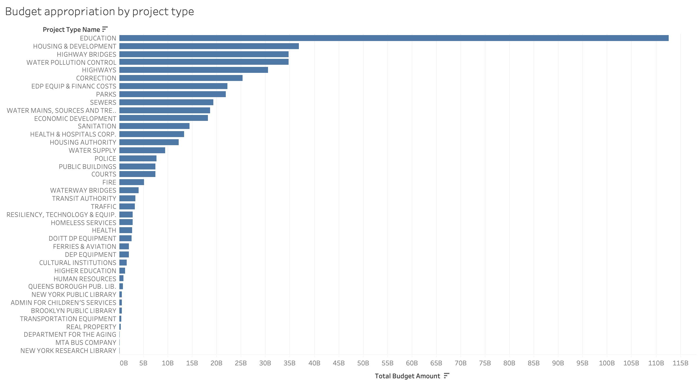
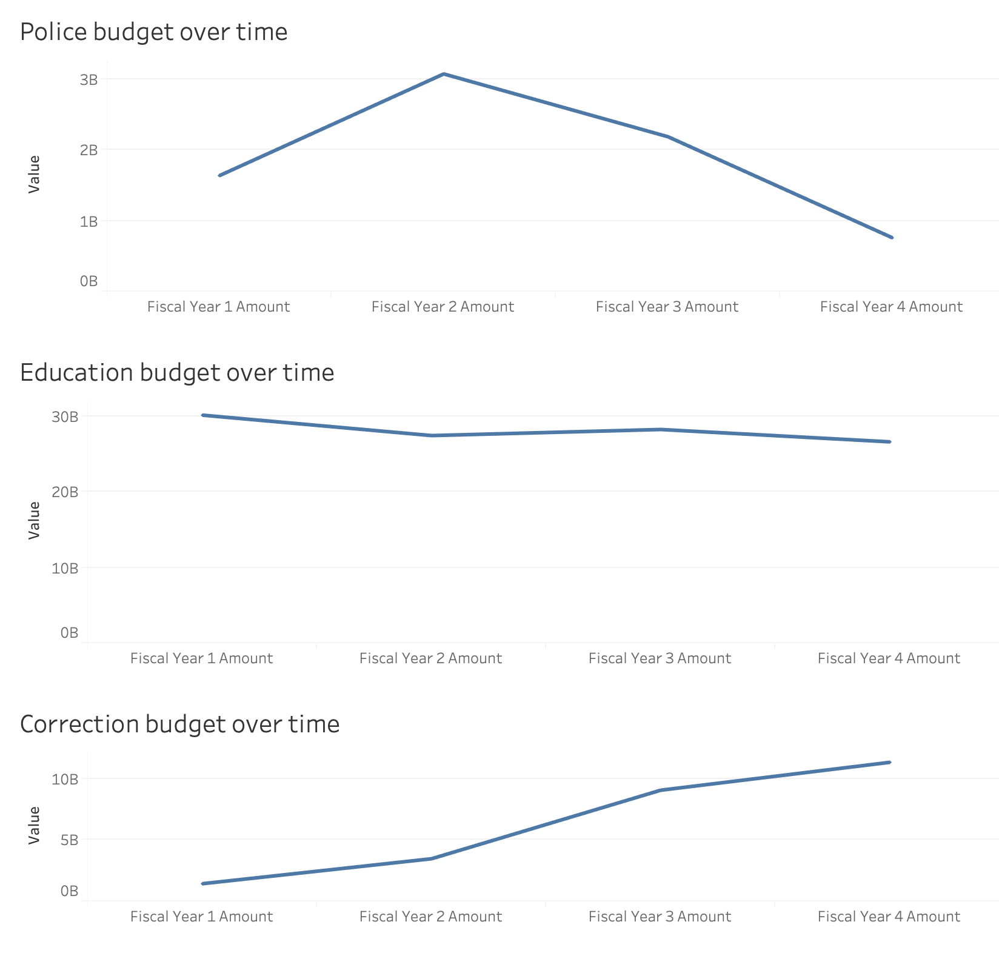
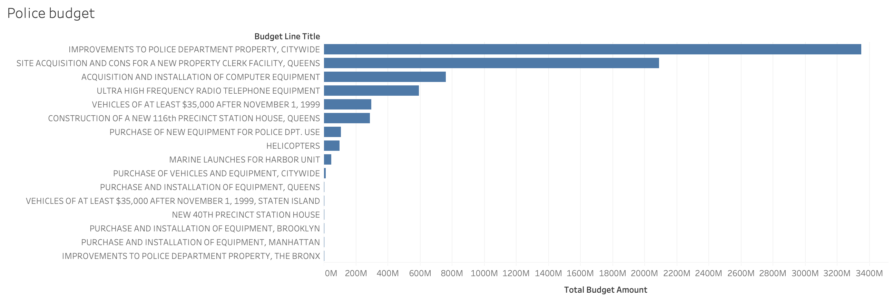

# New York City Budget Analysis

## Motivation

Much controversery has fallen upon city budgets for their perceived excessive funding to police departments. As a data scientist, I strive to formulate opinions through the  data. Therefore, I decided to dive into the data. I was inspired to see if the rhetoric about police spending in NYC was based in reality or political ideology. With that, the majority of the analysis will be framed around police spending.  I do want to note that as this can be a controversial topic, the findings of this analysis do not convey my political ideologies or beliefs in any capacity. 

## Data and questions
New York Cities capital budget can be found <a href="https://data.cityofnewyork.us/City-Government/Capital-Budget/46m8-77gv"> here </a>. I strived to answer a handfull of questions: (1) Where is NYC appropriating its fund? (2) Are budget appropriations increasing or decreasing over time for specific agencies/projects(i.e. education, police, etc.)? and (3) Within agencies/projects, where is money being appropriated?

## Assumptions
The data set has a column called "First Fiscal Year" that denotes when the specific project will begin recieiving funding. Funding started/starts for 33.86% projects in 2019, 33.17% in 2020 and 32.96% in 2021 (found <a href= "./eda.ipynb"> here </a>).  The following columns are "Fiscal Year 1 Amount," "Fiscal Year 2 Amount," and so on until "Fiscal Year 4 Amount." In order to aggregate the data, I created a "Total Budget Amount" column that reflects the sum of the four fiscal year amounts without regard to the "first fiscal year.'  

## Analysis 
### Question 1: Where is NYC appropriating its fund?

The dataset denotes the "Project Type Name" by agency. For example, Education, Housing & Development, Correction, Parks, etc. are considered Project Types. Based on the aggregated "Total Budget Amount," the top five most funded agencies or projects are: (1) Education: $112,630,941,060 / (2) Housing & Development: $38,876,057,247 / (3) Highway Bridges: $34,740,067,684 / (4) Water Pollution Control: $34,699,038,138 / and (5) Highways: $30,484,289,218. Corrections has the 6th highest funding amount at $25,285,190,537 and Police has the 16th higest funding amount at $7,649,723,283.

There has recently been calls for defunding the police department; that the NYPD had a budget of "almost 6 billion for the fiscal year of 2020" (<a href="https://www.cnn.com/2020/07/01/us/new-york-budget-nypd-1-billion-cut-trnd/index.html"> article link </a>). Again, I by no means am expressing my political opinion about 'defunding the police department' but based on the findings from the dataset I analyzed, it seems as though the cries for the excessiveness of the NYPD budget were politically motivated and rhetorical in nature, not neccesarily citing data for the claims. That being said, navigating the NYC Office of Management and Budget is not the most user friendly experience; the complexities of the cities budget makes it difficult to understand exactly what is being expressed; It is possible that the article cited above and the many more are citing a different data source then the one I analyzed. 

### Question 2: Are budget appropriations increasing or decreasing over time for specific angencies/projects?

The screenshot above shows four different graphs of budget appropriations for Police, Education, and Correction for the 4 fiscal years. At first glance, the image is decieving. Take note that the y-axis uses a different scale for each graph. That is, "Police spending over time" has a max value on the y-axis of $3 billion while "Education spending over time" has a max y-axis value of $30 billion. Because of this, a change of $1 billion dollars will look more significant on the "Police spending over time" graph then the "Education spending over time" graph. 

Mass incarceration and police brutality have spurred the conversation of police budgets to the national level. I chose to incorporate the budget over time for Correction because of the association between policing and jailing.

We can see that the police budget decreases from $2,184,169,000 to $759,420,000 from fiscal year 3 to fiscal year 4. It seems as though the BLM movement has made headway in terms of "defunding the police." That said, correlation does not equal causation and as a scientist I am cautious to make claims about cause and effect relationships. The budget for corrections does not tell the same story. That is, from fiscal year 2 to fiscal year 3, the budget jumps from $3,474,121,600 to $9,049,473,821. So while the budget for policing decreases by over 50% from year 3 to year 4, the budget for corrections increases by just under 300% from year 2 to year 3. 

### Question 3: Within agencies/projects, where is money being appropriated?

The graph above shows the budget line titles and the amount appropriated for said title within the NYPD. The largest budget line is for "improvements to police department property, citywide" for $3,348,850,922. The national conversation has frequently talked about increasing de-escalation and implicit bias training for police officers to combat police brutality. That said, it does not appear that there is any police training appropriated in the capital budget. This could mean that the NYC government does not budget for police training or police training is accounted for in another budget. Like I said before, navigating the NYC Office of Management and Budget is not a simple task. 

## Conlusion
The analysis of the capital budget has allowed me to generate some unique insights. It seems as though the claims that the 2020 budget for the NYPD was upwards of $6 billion are not true. The claim also misconstrues the fact that the police are the 16th highest funded agency/project in the capital budget. Based on the data analyzed, the police are appropriated about $7.5 billion over the next four years. In addition, it appears as though the budget will decrease over time which may be due to a whole host of unknown reasons including political pressure. While the police budget is set to decrease over the next four fiscal years, the corrections budget expands by almost 300% in one fiscal year. In terms of the geopolitical conversation on police brutality, mass incarceration and a healthier public infrastructure, redistributing appropriations to public needs is critical and expanding the corrections budget is moving in the wrong direction. 
